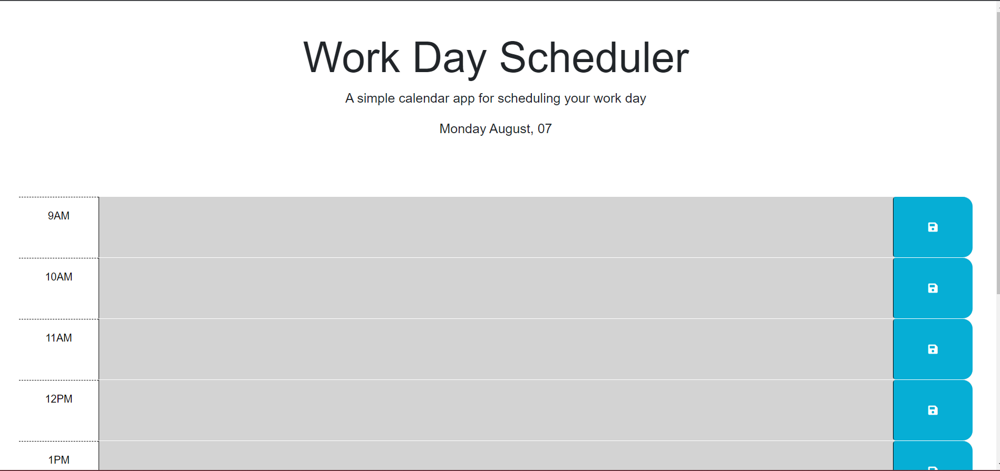

# Work-Day-Schedule
Creating an automated Schedule!

## Description
Provide a short description explaining the what, why, and how of your project. Use the following questions as a guide:
- What was your motivation?
    - To create a digital work day schedule for better organization and color coding past, present and future hours within the work day.
- Why did you build this project? (Note: the answer is not "Because it was a homework assignment.")
    - to gain further efficiency with Javascript and different functions and usability such as DayJS.
- What problem does it solve?
    - Helping keep work days organized with ease.
- What did you learn?
    - Javascript has a lot of usage options and I learned how people utilize Javascript and create websites.

## Installation
What are the steps required to install your project? Provide a step-by-step description of how to get the development environment running.
- Create a github repo with a unique name 
- clone the https github repo URL into git using the git clone function
- type in "code ." into git once the repo is saved on your computer
- VSCode will pop up onto your desktop and within VSCode you have the ability to edit and save committed material within VSCode. 
- this is communicating with Git when you are complete with changes utilize "git add ." to sync all changes
- use "git commit -m "enter commit messages" to commit the changes into git
- use "git push origin main" as the final push into github where you will see all of your saved changes and a copy of the code. 
## Usage
Provide instructions and examples for use. Include screenshots as needed.

To add a screenshot, create an `assets/images` folder in your repository and upload your screenshot to it. Then, using the relative filepath, add it to your README using the following syntax:

- Github: https://github.com/AmberDiehl1/Work-Day-Schedule
- Website: https://amberdiehl1.github.io/Work-Day-Schedule/

